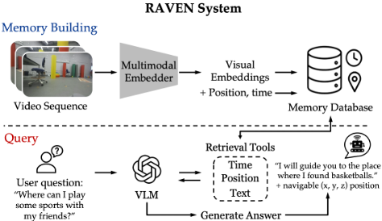

# ReMEmbR/RAVEN Framework - VLM Integration

Memory-augmented robot reasoning framework with Vision Language Models (VLMs) for navigation and object discovery.

## Paper, Poster & Write-ups

This repository bundles the research write-ups alongside the code:

| File | Description |
|------|-------------|
| `_RSS_2026__RAVEN__Visuo_Spatial_Temporal_Memory_System.pdf` | RAVEN paper (RSS 2026) |
| `IW_PAPER_FINAL.md` | Independent Work final paper |
| `IW_PAPER_DRAFT.md` / `.tex` / `.docx` | Independent Work paper drafts |
| `299_final_report.tex` / `.pdf` | ECE 299 final report |
| `poster.tex` | ECE 299 poster source (LaTeX; `puthesis_undergraduate.cls` is its class file) |
| `ece299_poster.pptx` | ECE 299 poster (PowerPoint) |
| `figures/` | Charts and figures used in the paper/poster |
| `CONTRIBUTIONS.md` | Contributions write-up |
| `RESEARCH_JOURNAL.md` | Research journal / progress log |

## What is RAVEN?

**RAVEN** (Hu et al., RSS 2026 — *Long-Horizon Reasoning and Navigation with Visuo-Spatial-Temporal Memory*) is a retrieval-augmented memory system for embodied agents. As a robot moves through an environment, RAVEN turns its long trajectory into a queryable memory and then lets a vision-language model reason over it.

<p align="center">
   multimodal embedder -> visual embeddings + position/time -> memory database) and query (user question -> VLM with time/position/text retrieval tools -> generated answer with navigable coordinates)" width="80%" />
</p>

**How it works:**

1. **Build the memory.** Each frame the robot sees is encoded into a high-dimensional visual embedding and written to a vector database *together with its pose* (x, y, z position + orientation) *and its timestamp*. This pairing of appearance + location + time is the "visuo-spatial-temporal" memory.
2. **Query it.** Given a natural-language question over the whole trajectory — e.g. *"Where did I last see the rubber duck?"*, *"What was next to the blue chair?"*, *"How long after entering the kitchen did I pass a fire extinguisher?"* — the system retrieves the most relevant frames (top-K) from the vector store.
3. **Reason with a VLM agent.** A vision-language model acts as a **tool-using agent**: it inspects the retrieved frames, can issue follow-up retrievals to gather more evidence, and then produces an answer — typically grounded as a **coordinate (position) and time**, not just free text.

This decomposition — a fast embedding retriever for *recall* plus a VLM agent for *spatial/temporal/negation reasoning* — is what lets RAVEN answer multi-step questions over minutes-long trajectories that a pure retriever cannot.

### This repository

This is the **ReMEmbR / RAVEN framework implementation** plus an **independent evaluation of open-source VLMs** inside it (Edison Zhu, Princeton ECE Independent Work; adviser Prof. Dhruv Shah, mentor Yixun Hu — a RAVEN co-author). RAVEN's published evaluation mostly benchmarks *closed* VLMs (Gemini, GPT) and reports that mid-sized *open* VLMs can underperform an embedder-only floor. This work probes exactly where the VLM stops being optional: on a difficulty-stratified 19-question Habitat suite from the DARPA TIAMAT simulation harness, **embedder-only retrieval saturates at ~5–7/19**, while **adding the VLM agent on the *same* QQMM retriever lifts it to 15/19 (+42 pp)** — the entire gain concentrated on spatial, multi-step, and negation reasoning (levels L3–L5). See `IW_PAPER_FINAL.md` and the RAVEN paper PDF for the full study.

## Overview

This framework provides multiple approaches for robot memory and reasoning:
- **EmbedderOnlyAgent**: Pure embedding-based retrieval (fastest, no LLM)
- **VLMNonAgent**: Direct VQA without reasoning loop (medium speed)
- **ReMEmbRAgent**: Memory + LLM reasoning with tool calling (slower, more capable)
- **RAVENAgent**: Advanced multi-modal reasoning with image tools (most capable)

## Components

### Agents

| Agent | Description | Speed | Use Case |
|-------|-------------|-------|----------|
| **EmbedderOnlyAgent** | Pure embedding-based retrieval | ⚡⚡⚡ Fast | Quick position/time lookup |
| **VLMNonAgent** | Direct VQA without reasoning | ⚡⚡ Medium | Simple visual questions |
| **ReMEmbRAgent** | Memory + LLM tool calling | ⚡ Slow | Complex reasoning tasks |
| **RAVENAgent** | Multi-modal with image tools | ⚡ Slow | Advanced reasoning + VQA |

### VLM Backends

**Closed APIs (High Quality):**
- **OpenAI**: GPT-4V, GPT-5.2
- **Google**: Gemini 2.5 Flash, Gemini 3 Pro

**Open-Source (via Ollama):**
- **Qwen VL**: qwen2.5vl-3b, qwen2.5vl-32b, qwen3-vl-32b
- **Gemma**: gemma3-1b, gemma3-27b

### Memory Backends

- **FAISS**: Local vector database (recommended for dev)
- **Milvus**: Distributed vector database (production)

### Embedders

| Embedder | Dimension | Type | Best For |
|----------|-----------|------|----------|
| **CLIP (ViT-H-14)** | 1024 | General | General vision tasks |
| **QQMM (nav_qwen2)** | 3584 | Navigation | Robot navigation (SOTA) |
| **DINOv3** | 1536 | Self-supervised | Visual features |
| **Seed** | 2048 | Online API | Cloud-based embedding |
| **Google Multimodal** | 2048 | Online API | Cloud-based embedding |

## Installation

```bash
# Core dependencies
pip install torch transformers pillow pyyaml

# VLM APIs
pip install openai google-cloud-aiplatform volcengine-python-sdk

# Vector database
pip install faiss-cpu  # or faiss-gpu for CUDA
pip install pymilvus  # optional, for Milvus backend

# LangChain (for reasoning agents)
pip install langchain==0.3.27 langgraph==0.4.0

# QQMM embeddings (navigation-optimized)
# Already included in this repo at agent/v2/remembr/qqmm/
```

## Quick Start

### 1. Pure Embedding Retrieval (Fastest)

```python
from remembr.agents.embedder_only_agent import EmbedderOnlyAgent
from remembr.embedder.embedders import VLMEmbeddings
from remembr.memory.memory_factory import MemoryFactory

# Initialize QQMM embedder (navigation-optimized)
embedder = VLMEmbeddings(
    backend="hf",
    hf_model_id="youzexue/QQMM-embed-v2",
    emb_dim=3584,
    device="cuda"
)

# Create FAISS memory
memory = MemoryFactory.create_memory(
    backend="faiss",
    embedder=embedder,
    use_vlm_embedding=True,
    dim=3584,
    storage_path="./memory_storage"
)

# Initialize agent
agent = EmbedderOnlyAgent()
agent.set_memory(memory)

# Query
result = agent.query("Where is the rubber duck?")
print(f"Position: {result.position}")
print(f"Time: {result.time}")
print(f"Confidence: {result.similarity_score}")
```

### 2. VLM Direct QA (Medium Speed)

```python
from remembr.agents.vlm_non_agent import VLMNonAgent

# Using Gemini 2.5 Flash
agent = VLMNonAgent(
    vlm_backend="google",
    model_id="gemini-2.5-flash",
    prompt_folder="./remembr/prompts/darpa_vlm_prompts"
)

response = agent.query("Where did I see the blue chair?")
print(response)
```

### 3. Full Reasoning Agent (Most Capable)

```python
from remembr.agents.raven_agent import RAVENAgent

# Using GPT-4o with QQMM embeddings
agent = RAVENAgent(
    vlm_backend="openai",
    model_id="gpt-4o",
    embedder=embedder,
    memory=memory,
    prompt_folder="./remembr/prompts/darpa_vlm_prompts",
    max_tool_calls=3
)

response = agent.query("Find the rubber duck and tell me what's next to it")
print(response)
```

### 4. Using Captioners for Auto-Description

```python
from remembr.captioners.vila_captioner import VILACaptioner

# Using OpenAI GPT-4o-mini for captioning
captioner = VILACaptioner(api_key="your-openai-key")
caption = captioner.caption_image("path/to/frame.jpg")
print(f"Caption: {caption}")
```

## Configuration System

The framework uses hierarchical YAML configs with inheritance via `_base_` key.

### Loading VLM Configs

```python
from remembr.utils.util import load_yaml_with_base

# Load VLM config (automatically resolves _base_ inheritance)
config = load_yaml_with_base("cfgs/vlms/gf25.yaml")
print(config)
# Output: {'params': {'backend': 'google', 'model_id': 'gemini-2.5-flash', ...}}
```

### VLM Model Selection

```bash
# Using config files
python your_script.py --vlm_config cfgs/vlms/gf25.yaml  # Gemini 2.5 Flash
python your_script.py --vlm_config cfgs/vlms/gpt52.yaml  # GPT-5.2
python your_script.py --vlm_config cfgs/vlms/qwen25vl-32b.yaml  # Qwen VL (offline)
```

### Embedder Selection

```bash
# Using config files
python your_script.py --embedder_config cfgs/embedders/qqmm.yaml  # QQMM (SOTA)
python your_script.py --embedder_config cfgs/embedders/clip.yaml  # CLIP
```

### Agent Selection

```bash
# Using config files
python your_script.py --agent_config cfgs/agents/embedder_only.yaml
python your_script.py --agent_config cfgs/agents/raven.yaml
```

## Environment Variables

```bash
# OpenAI (for GPT models and captioning)
export OPENAI_API_KEY="sk-..."

# Google Cloud (for Gemini models)
export GOOGLE_APPLICATION_CREDENTIALS="path/to/service-account.json"

# Seed/Doubao (for Seed embeddings)
export SEED_API_KEY="your-seed-key"
```

## Advanced Usage

### Custom Memory Backend

```python
from remembr.memory.memory_factory import MemoryFactory

# FAISS (local, file-based)
memory = MemoryFactory.create_memory(
    backend="faiss",
    db_collection_name="my_robot_memory",
    embedder=embedder,
    use_vlm_embedding=True,
    storage_path="./faiss_storage",
    dim=3584,
    retriever_k=5
)

# Milvus (distributed, production)
memory = MemoryFactory.create_memory(
    backend="milvus",
    db_collection_name="robot_memory_prod",
    embedder=embedder,
    use_vlm_embedding=True,
    db_ip="localhost",
    db_port=19530,
    dim=3584,
    retriever_k=5
)
```

### Batch Image Captioning

```python
from remembr.captioners.vila_captioner import VILACaptioner
from PIL import Image

captioner = VILACaptioner(api_key="your-key")

# Batch processing
images = [Image.open(f"frame_{i}.jpg") for i in range(10)]
captions = [captioner.caption([img]) for img in images]
```

### QQMM with 4-bit Quantization (Save GPU Memory)

```python
from remembr.embedder.embedders import VLMEmbeddings

embedder = VLMEmbeddings(
    backend="hf",
    hf_model_id="youzexue/QQMM-embed-v2",
    emb_dim=3584,
    device="cuda",
    load_in_4bit=True  # Enable 4-bit quantization
)
```

## Architecture Details

### Memory Item Structure

```python
@dataclass
class VLMMemoryItem:
    caption: str  # Text description
    time: float  # Unix timestamp
    position: np.ndarray  # [x, y, z] position
    theta: float  # Orientation angle
    image_file_path: str  # Path to image
    image_filenames: list  # List of related image files
```

### FAISS Memory Storage

```
./faiss_storage/
├── my_robot_memory_text.index  # VLM embedding index
├── my_robot_memory_position.index  # Position index
├── my_robot_memory_time.index  # Time index
└── my_robot_memory_metadata.json  # Metadata (captions, paths, etc.)
```

## Prompt Sets

Available prompt sets in `remembr/prompts/`:

- **darpa_vlm_prompts/**: DARPA competition tasks
- **go1_vlm_prompts/**: Go1 robot tasks
- **irs_vlm_prompts/**: Indoor robot scenarios
- **fd_vlm_prompts/**: FindingDory benchmark (furniture/object manipulation)
- **navqa_vlm_prompts/**: Navigation QA benchmark
- **sim_real_vlm_prompts/**: Sim-to-Real transfer tasks

Each prompt set contains:
- `agent_system_prompt.txt` - Multi-turn reasoning with tools
- `non_agent_system_prompt.txt` - Direct VQA without agent loop
- `agent_gen_system_prompt.txt` - Agent-based generation
- `generate_system_prompt.txt` - Direct generation

## Performance Comparison

| Approach | Speed | Quality | Memory Usage | Use Case |
|----------|-------|---------|--------------|----------|
| Embedder-Only | ⚡⚡⚡ | ⭐⭐ | Low | Quick lookups |
| VLM Non-Agent | ⚡⚡ | ⭐⭐⭐ | Medium | Simple VQA |
| ReMEmbR | ⚡ | ⭐⭐⭐⭐ | High | Complex reasoning |
| RAVEN | ⚡ | ⭐⭐⭐⭐⭐ | High | Advanced multi-modal |

## Troubleshooting

### Import Errors

```python
# If you get "No module named 'remembr'"
import sys
sys.path.append('/path/to/darpa-tiamat-competition-code/agent/v2')
```

### CUDA Out of Memory

```python
# Use 4-bit quantization for QQMM
embedder = VLMEmbeddings(..., load_in_4bit=True)

# Or use smaller batch size
embedder = VLMEmbeddings(..., batch_size=16)  # Default is 64
```

### FAISS Index Not Found

```python
# Ensure storage path exists
from pathlib import Path
Path("./faiss_storage").mkdir(parents=True, exist_ok=True)
```

## References

- **ReMEmbR**: Memory-based reasoning framework
- **RAVEN**: Long-horizon reasoning with visuo-spatial-temporal memory
- **QQMM**: Navigation-optimized multimodal embeddings
- **VLFM**: Vision-Language-Foundation Models for navigation

## Citation

If you use this code, please cite the original papers:

```bibtex
@article{raven2026,
  title={RAVEN: Long-Horizon Reasoning and Navigation with Visuo-Spatial-Temporal Memory},
  year={2026}
}

@article{qqmm2025,
  title={QQMM: Qwen-based Navigation Memory Model},
  year={2025}
}
```

## License

See the main repository LICENSE file. This module is part of the DARPA TIAMAT competition codebase.

## Support

For issues or questions:
- Check existing code examples in `agent/v2/remembr_static_eval_vlm.py`
- Review configuration examples in `agent/v2/cfgs/`
- Consult prompt templates in `agent/v2/remembr/prompts/`
